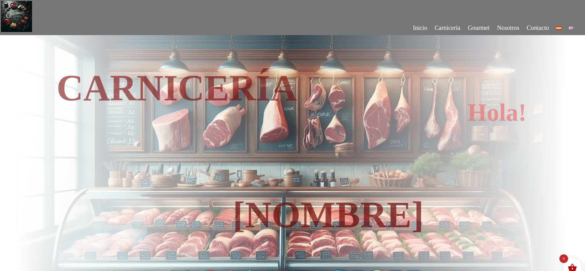

theme wordpress

Theme Name: codebaou-hal21-theme-base

Theme URI: codebaou-hal21

Author: codebaou

Author URI: https://hal21.es/

Description: Tema para los clientes de hal21 & codebaou

Version: 1.0.0

License: GNU General Public License v2 or later

License URI: http://www.gnu.org/licenses/gpl-2.0.html

== Description ==

Un tema wordpress compatible con woocommerce y polylang. Añade solucciones de tradución de menus (polylang lo introduce de forma premium solo), estilo para plantillas woocommerce, plantillas páginas "Legal" con variables que completan mediante formulario y coleccion de bloques gutemberg que soluccionan necesidades especificas de los clientes.

== Copyright ==

(C) 2024 hal21, 2025
(C) codebaou , 2024

License URI: https://choosealicense.com/licenses/agpl-3.0/

En el fichero changelog.txt, se lista todo lo que contiene en tema por version.

Formulario para rellenar las plantillas de las páginas legales.

Plantillas de página:
    COMUNES_
    * page-contacto.html
    * page-nosotros.html
    LEGAL
    * page-legal.html
    * page-accesibilidad.html
    * page-politica-cookies-ue.html
    * page-politica-privacidad.html
    * page-terminos-y-condiciones.html
    WOOCOMMERCE
    * page-mi-cuenta.html