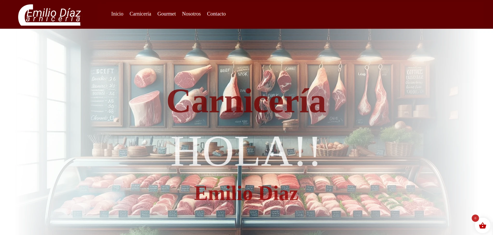

=== codebaou hal21 base ===
Theme Name: codebaou-hal21-theme-base
Theme URI: codebaou-hal21
Author: codebaou
Author URI: https://hal21.es/
Description: Tema para los clientes de hal21 & codebaou
Requires at least: 6.6.1
Tested up to: 6.6.1
Requires PHP: 8.1.29
Version: 1.0.0
License: GNU General Public License v2 or later
License URI: http://www.gnu.org/licenses/gpl-2.0.html
Text Domain: codebaou-hal21-theme hal21 codebaou
Tags: kitdigital hal21 codebaou multilenguaje empresa personal

== Description ==

Un tema wordpress compatible con woocommerce y polylang. Añade solucciones de tradución de menus (polylang lo introduce de forma premium solo), estilo para plantillas woocommerce, plantillas páginas "Legal" con variables que completan mediante formulario y coleccion de bloques gutemberg que soluccionan necesidades especificas de los clientes.

    
== Copyright ==

(C) 2024 hal21, 2025
(C) codebaou , 2024

License URI: https://choosealicense.com/licenses/agpl-3.0/

== Changelog ==

= 1.0.0 =
* Released: Setiembre, 18 , 2024
    - Templates
        - 404.html ,archive.html, front-page.html, front-page.html, home.html, index.html, accesibilidad.html, page-contacto.html, (1) page-[].html, page-legal.html, page-mi-cuenta.html, page-nosotros.html, page-politica-cookies.html, page-politica-privacidad.html, page-terminos-y-condiciones.html.
        - + 14 templates

    - parts
        - Plantilla de documentos legales. Los documentos legales son el texto legal y se rellenan de forma automática en las plantillas correspondientes.
        - header, simple.
        - footer completo.
        - +1 seccion de diseño para el frontend.

    - Registro de fuentes
        - Gruppo
        - Lato
        - Monserrat

    - Estilos plantillas woocommerce
        - carrito, catalogo, confimacion-pedido, finaliza-compra, paginas de tiendas.
        - + 6 plantillas
    
    - Funcionalidad
        - Menu principal , personalizable con compatibilidad con polylang.
        - Menu secundario para las paginas legales con compatibilidad con polylang.
        - Api Rest 
            - Ruta , consulta informacion para texto legales.
            - Ruta , Obtener menus.
            - Ruta , Obtener datos del perfil de usuario.

        - Formulario, en Usuario > perfil > Datos Legales, Permite personalizar los datos de una persona legal en todos las plantillas de paginas Legales.
    
    - Bloques Gutemberg (React)
        - Image personalizable desde editor, carga el tamaño de recorte de imagen correcto según el tamaño de la pantalla y carga LazyLoad.
        - Menu primario compatible con polylang.
        - Menu secundaro compatiblecon polylang.

